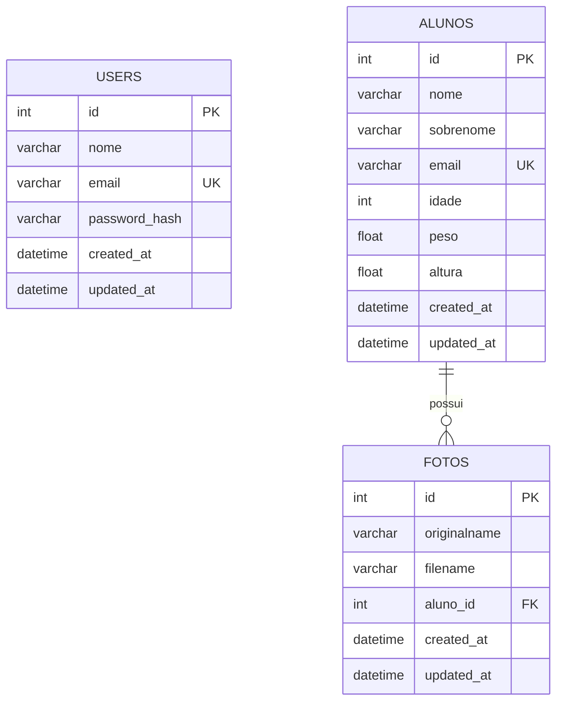

# 🏫 Escola API RESTful — Node.js, Express & Sequelize


---

## 🔗 Ambiente Local e Portas da Aplicação

* **Ambiente de Desenvolvimento:** `http://localhost:3001`
* **Serviço de Arquivos Estáticos (Uploads):** `http://localhost:3001/images/`
* **Front-End Integrado:** Desenvolvido em conjunto com o repositório cliente [Site_Escola_React_Redux_API](https://github.com/erickystn/Site_Escola_React_Redux_API)

---

## 📖 Visão Geral

A **Escola API RESTful** é uma aplicação de back-end em **Node.js** e **Express**, utilizando o ORM **Sequelize** sobre **MySQL/MariaDB**, arquitetada para atender às demandas de gerenciamento acadêmico de alunos, fotos e usuários de uma instituição de ensino.

A API adota o padrão **MVC (Model-View-Controller)** desacoplado, expondo endpoints RESTful com validações estritas de schema, controle de sessão stateless baseado em tokens **JWT**, hashing irreversível de senhas com **BCrypt**, upload de arquivos estáticos via **Multer** e cabeçalhos de segurança corporativa configurados com **Helmet** e **CORS** restritivo.

---

## ✨ Funcionalidades

* 🔐 **Autenticação & Controle de Sessão (`/tokens`):**
  * Emissão de token JWT assinado para usuários cadastrados válidos.
  * Middleware de interceptação `loginRequired` validando cabeçalho Bearer e persistência do usuário.
* 👤 **Gerenciamento de Usuários Operadores (`/users`):**
  * Cadastro de novos administradores com validações de e-mail único e tamanho mínimo de senha.
  * Atualização de dados cadastrais e exclusão restritas ao próprio usuário autenticado.
* 👨‍🎓 **Gestão Completa de Alunos (`/alunos`):**
  * Listagem pública ordenada de alunos trazendo fotos associadas em eager loading.
  * Consulta detalhada de aluno por ID com histórico de fotos anexadas.
  * Criação, edição e exclusão de cadastros de alunos restritas a operadores logados.
* 📸 **Upload e Processamento de Imagens (`/fotos`):**
  * Upload de avatares com filtro rigoroso de extensão MIME (`image/png`, `image/jpeg`).
  * Geração de nomes aleatórios com timestamp para evitar colisão de arquivos em disco.
  * Campo virtual no Sequelize gerando dinamicamente a URL pública absoluta de cada imagem.

---

## 🎯 Diferenciais e Destaques Técnicos

1. **Campos Virtuais no Sequelize (`VIRTUAL`):**
   * **Senha Segura:** A entidade `User` recebe a senha em texto plano via setter virtual, valida o tamanho e gera automaticamente o `password_hash` com BCrypt antes de persistir, nunca salvando a senha original.
   * **URL Absoluta de Imagem:** A entidade `Foto` monta dinamicamente o link completo de acesso (`http://APP_URL:PORT/images/filename`) através de um getter virtual.
2. **Camada de Proteção com Helmet & CORS Dinâmico:** Aplicação configurada com lista de permissões (*whitelisting*) aceitando apenas requisições originadas de clientes autorizados.
3. **Migrações e Seeds com Sequelize CLI:** Gerenciamento de evolução do esquema relacional e dados de demonstração através de scripts versionados em `src/database/migrations`.
4. **Compatibilidade com Deploy Serverless:** Estrutura adaptada com arquivo `vercel.json` e arquivo de entrada raiz para execução em nuvem.

---

## 🏗️ Estrutura do Repositório

```text
src/
├── app.js                      # Configuração do Express, middlewares, CORS e rotas
├── server.js                   # Inicialização do servidor HTTP e escuta na porta
├── config/
│   ├── appConfig.js            # URL e porta do serviço
│   ├── database.js             # Configurações de conexão do Sequelize (Dialect, Pools, TZ)
│   └── multerConfig.js         # Filtro de extensões e destino de uploads
├── controller/
│   ├── AlunoController.js      # CRUD de Alunos
│   ├── FotoController.js       # Recepção de uploads e gravação no banco
│   ├── HomeController.js       # Healthcheck inicial
│   ├── TokenController.js      # Autenticação e geração de JWT
│   └── UserController.js       # CRUD de Usuários operadores
├── database/
│   ├── index.js                # Inicialização e associação de modelos
│   ├── migrations/             # Migrações relacionais do banco de dados
│   └── seeds/                  # Dados iniciais de teste
├── middlewares/
│   └── loginRequired.js        # Validação do token JWT e injeção de req.userId
├── model/
│   ├── Aluno.js                # Modelo de Alunos com validações
│   ├── Foto.js                 # Modelo de Fotos com getter de URL
│   └── User.js                 # Modelo de Usuários com hash de senha
├── routes/
│   ├── alunoRoutes.js
│   ├── homeRoutes.js
│   ├── photoRoutes.js
│   ├── tokenRoutes.js
│   └── userRoutes.js
├── util/                       # Helpers utilitários
static/
└── uploads/
    └── images/                 # Diretório físico de armazenamento das fotos
```

---

## 🎲 Modelagem do Banco de Dados (DER)



---

## 📋 Tabela de Endpoints

### 1. Autenticação & Usuários
| Método | Rota | Autenticação | Descrição |
| :--- | :--- | :--- | :--- |
| `POST` | `/tokens` | Pública | Login com e-mail e senha, retornando JWT |
| `POST` | `/users` | Pública | Cadastro de novo usuário operador |
| `GET` | `/users` | Pública | Listagem de usuários (apenas ID, nome e e-mail) |
| `PUT` | `/users` | Bearer JWT | Atualização do próprio perfil logado |
| `DELETE` | `/users` | Bearer JWT | Exclusão do próprio usuário logado |

### 2. Alunos (`/alunos`)
| Método | Rota | Autenticação | Descrição |
| :--- | :--- | :--- | :--- |
| `GET` | `/alunos` | Pública | Lista todos os alunos com suas respectivas fotos |
| `GET` | `/alunos/:id` | Pública | Consulta detalhes de um aluno por ID |
| `POST` | `/alunos` | Bearer JWT | Cadastra novo aluno no sistema |
| `PUT` | `/alunos/:id` | Bearer JWT | Atualiza dados de um aluno existente |
| `DELETE` | `/alunos/:id` | Bearer JWT | Remove um aluno do sistema |

### 3. Fotos (`/fotos`)
| Método | Rota | Autenticação | Descrição |
| :--- | :--- | :--- | :--- |
| `POST` | `/fotos` | Bearer JWT | Upload de imagem (`multipart/form-data`) vinculada a aluno |

---

## ⚙️ Requisitos e Instalação

### Pré-requisitos
* **Node.js:** Versão 18 ou superior.
* **Banco de Dados:** MySQL ou MariaDB rodando localmente na porta 3306.
* **Gerenciador de Pacotes:** `npm`.

### 1. Clonar o Repositório
```bash
git clone https://github.com/erickystn/API_REST_NODE-SEQUELIZE.git
cd API_REST_NODE-SEQUELIZE
```

### 2. Instalar as Dependências
```bash
npm install
```

### 3. Configurar Variáveis de Ambiente
Crie um arquivo `.env` na raiz do projeto com base no `.env.example`:
```env
DATABASE=escola
DATABASE_HOST=localhost
DATABASE_PORT=3306
DATABASE_USERNAME=root
DATABASE_PASSWORD=root

TOKEN_SECRET=seu_segredo_jwt_super_seguro
TOKEN_EXPIRATION=7d

APP_URL=http://localhost
APP_PORT=3001
```

### 4. Executar as Migrações do Banco
```bash
npx sequelize db:migrate
```

---

## 🚀 Como Executar

```bash
# Modo de desenvolvimento (com nodemon):
npm run dev

# Modo de produção:
npm start
```

O servidor iniciará em `http://localhost:3001`.

---

## 💻 Exemplos de Requisições via cURL

### 1. Obter Token de Acesso (`POST /tokens`)
```bash
curl -X POST http://localhost:3001/tokens \
  -H "Content-Type: application/json" \
  -d '{
    "email": "admin@escola.com",
    "password": "senhaSegura123"
  }'
```

### 2. Cadastrar Novo Aluno (`POST /alunos`)
```bash
curl -X POST http://localhost:3001/alunos \
  -H "Content-Type: application/json" \
  -H "Authorization: Bearer <SEU_TOKEN_JWT>" \
  -d '{
    "nome": "Lucas",
    "sobrenome": "Menezes",
    "email": "lucas@email.com",
    "idade": 21,
    "peso": 75.5,
    "altura": 1.78
  }'
```

---

## 🛠️ Tecnologias Utilizadas

| Tecnologia | Versão | Finalidade |
| :--- | :--- | :--- |
| **Node.js** | 18+ | Ambiente de execução JavaScript no servidor |
| **Express** | 4.19 | Framework HTTP minimalista e modular |
| **Sequelize** | 6.37 | ORM relacional com suporte a migrações e validações |
| **MariaDB / MySQL2** | 3.3 / 3.9 | Drivers de banco relacional SQL |
| **Bcryptjs** | 2.4 | Criptografia irreversível de senhas |
| **JsonWebToken** | 9.0 | Autenticação baseada em tokens stateless |
| **Multer** | 1.4 | Processamento e armazenamento de uploads multipart/form-data |
| **Helmet & Cors** | 7.1 / 2.8 | Proteção de cabeçalhos e controle de origens HTTP |

---

## 👤 Autor & 📄 Licença

Desenvolvido por **[Ericky Sant'ana](https://github.com/erickystn)**.

Distribuído sob a licença **MIT**.
